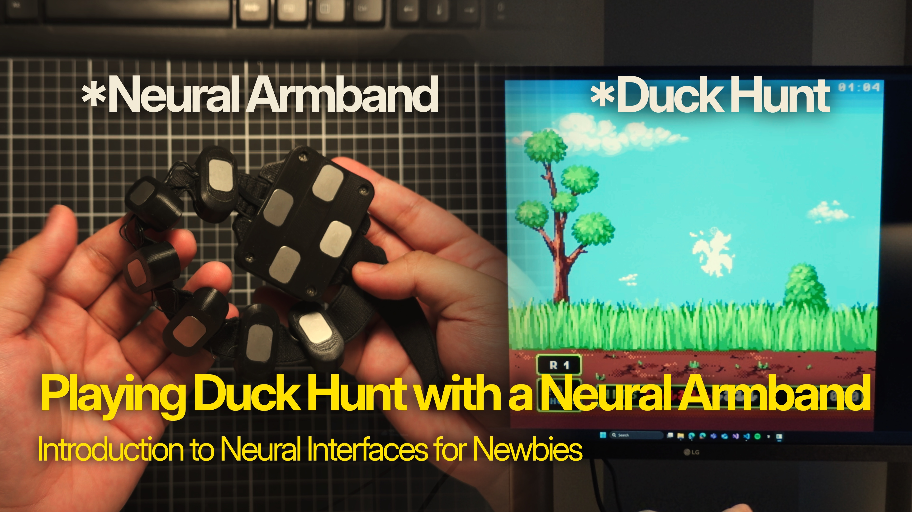

# EMG and IMU Mouse Control

This project is a snippet from my YouTube video on basic EMG development. By using this with a [**MindRove Arb**](https://mindrove.com/armband/) device, you can control your mouse cursor using muscle contractions and perform left clicks by flexing your arm muscle.

This setup is perfect for demonstrating unique interactions, such as playing Duck Hunt or other simple mouse-controlled games. For advanced gesture recognition, consider exploring [**NaviFlame**](https://github.com/MindRove/NaviFlame), which can detect up to seven distinct gestures.

## Installation

### Requirements

- Python 3.8 or higher
- Poetry
- NumPy
- Mindrove
- PyAutoGUI
- Matplotlib

### Setup

1. **Install Poetry:**
   ```sh
   pip install poetry
   ```
2. **Install Dependencies:**
   ```sh
   poetry install
   ```

## Running the Script

To start the EMG-based mouse control:

```sh
poetry run python -m mindrove_armband
```

## Credits

Special thanks to **Daniel The Fox** for creating [Duck Hunt Remastered](https://danielthefox.itch.io/duck-hunt-remastered). This project was done with the thought that by a modernized Duck Hunt deserves an equally innovative control interface.
